#  Sanskrit Text Segmentation System

A comprehensive, research-grade deep learning pipeline for separating Sanskrit Devanagari text from decorative manuscript elements (borders, illustrations, stains, and artifacts).

This project implements a highly customized **Mini U-Net Convolutional Neural Network (CNN)** built entirely from scratch in PyTorch, tailored specifically for the morphological structure of Devanagari script.

---

##  Tech Stack

* **Deep Learning:** `PyTorch`, `TorchMetrics`
* **Computer Vision:** `OpenCV (cv2)`, `NumPy`
* **Data Augmentation:** `Albumentations`
* **Monitoring:** `TensorBoard`
* **Configuration:** `PyYAML`

---

##  Pipeline Architecture

```mermaid
flowchart LR
    subgraph Input
        A["Grayscale Manuscript<br/>Image"]
    end
    subgraph Preprocessing
        B["CLAHE + Denoise<br/>+ Normalize"]
    end
    subgraph Patches
        C["Overlapping Patch<br/>Extraction (256×256)"]
    end
    subgraph Model["Mini U-Net"]
        D["Encoder<br/>1→32→64→128"]
        E["Bottleneck<br/>MultiScale + Dilated"]
        F["Decoder<br/>128→64→32"]
        G["1×1 Conv + Sigmoid"]
        D --> E --> F --> G
    end
    subgraph Output
        H["Patch Stitching<br/>+ Thresholding"]
        I["Morphological<br/>Postprocessing"]
        J["Binary Mask<br/>+ Text Extraction"]
    end
    A --> B --> C --> D
    G --> H --> I --> J
```



---

##  Model Architecture: The "Mini U-Net"

Standard U-Nets are designed for medical imaging. This architecture was custom-engineered to handle the unique challenges of historical Indian manuscripts (thin *shirorekha* strokes combined with massive, intricate floral borders).

### 1. Encoder (Downsampling)
Compresses the image through 3 stages (32 $\rightarrow$ 64 $\rightarrow$ 128 channels) using $3 \times 3$ Convolutions and Max Pooling. This forces the network to learn the "semantic meaning" of the page rather than memorizing exact pixels. Residual connections ensure fine stroke details aren't lost during compression.

### 2. The Bottleneck (Deepest Layer)
At the bottom of the U-Net (256 channels), the network analyzes the most compressed data using two advanced techniques:
* **Multi-Scale Convolution:** Passes data simultaneously through $1 \times 1$, $3 \times 3$, and $5 \times 5$ kernels. This allows the model to detect tiny punctuation marks and massive title fonts at the exact same time.
* **Dilated Convolutions:** Spreads the kernel out (rates 2 and 4) to give the model a massive "field of view," allowing it to understand if a line belongs to a character or a massive decorative border.

### 3. Decoder (Upsampling) & Attention Gates
Upsamples the image back to its original $256 \times 256$ size. It uses **Attention Gates** on the skip-connections coming from the Encoder. This forces the model to actively multiply background artwork by zero, strictly focusing its memory entirely on the text regions.

### 4. Output
A $1 \times 1$ Convolution paired with a `Sigmoid` activation outputs a probability map (0.0 to 1.0) indicating the likelihood of every single pixel being Sanskrit text.

---

##  End-to-End Pipeline Methodology

### Phase 1: Data Preparation & Pseudo-Ground Truth
Because historical manuscripts rarely have pixel-perfect manual annotations, the pipeline includes an **Automatic Mask Generator** (`auto_mask_generator.py`). 
* It uses classical computer vision (Adaptive Gaussian Thresholding, CLAHE contrast enhancement).
* It applies specialized algorithms to suppress large "illustration blobs" and reinforce horizontal lines.
* This generates high-quality training labels from raw scanned images automatically.

### Phase 2: Preprocessing & Patch Extraction
Massive manuscript images (e.g., 4K resolution) cannot fit into GPU memory. 
* Images are normalized and sliced into overlapping $256 \times 256$ patches.
* **Albumentations** applies aggressive data augmentation (Elastic Transforms, Gaussian Blur, Rotations) to artificially degrade the text, forcing the model to learn highly resilient features.

### Phase 3: Training
* **Loss Function:** Uses a heavily weighted mix of **Dice Loss (75%)** and **Binary Cross Entropy (25%)**. This perfectly handles the extreme class imbalance (a page is 90% background and 10% text).
* **Optimizer:** `AdamW` (with weight decay) combined with a `ReduceLROnPlateau` scheduler to dynamically lower the learning rate when training stalls, squeezing out maximum accuracy.

### Phase 4: Inference & Post-processing
During inference, the model predicts the patches, but they must be stitched back together.
* **Gaussian Blending:** Patches are stitched using a 2D Gaussian falloff weight map. This eliminates the harsh visible "seams" that usually occur when stitching image patches.
* **Morphological Closing:** A custom post-processing step actively repairs broken *shirorekha* (the horizontal line connecting Devanagari characters) that might have fragmented during scanning.

---

## 🛠 Installation & Setup

### Prerequisites
* Python 3.11+
* Git

### Setup
```bash
# Clone the repository
git clone <your-repo-url>
cd sanskrit_text_segmentation

# Create virtual environment
python -m venv venv
source venv/bin/activate  # macOS/Linux

# Install dependencies
pip install -r requirements.txt
```

---

## 💻 Usage Instructions

The entire system is controlled via a single CLI entry point (`src/main.py`) and is entirely hardware-agnostic (automatically utilizing NVIDIA CUDA, Apple Silicon MPS, or standard CPUs).

### 1. Configuration
All hyperparameters are exposed in the `configs/` folder. You never need to edit the Python code to tune the model.
* `configs/model.yaml` (Architecture parameters)
* `configs/train.yaml` (Augmentation, learning rate, epochs)
* `configs/inference.yaml` (Thresholding and post-processing limits)

### 2. Prepare Data
Place your raw `.png` or `.jpg` manuscript scans into `dataset/raw/`.

### 3. Generate Masks & Patches
If you don't have manual masks, generate them and slice the patches:
```bash
python3 -c "import sys; sys.path.insert(0, '.'); from src.data.auto_mask_generator import generate_masks_for_directory; generate_masks_for_directory('dataset/raw', 'dataset/masks')"

python3 -m src.main preprocess --config configs/train.yaml
python3 -m src.main patches --config configs/train.yaml
```

### 4. Train the Model
```bash
python3 -m src.main train --config configs/train.yaml
```
*Monitor training in real-time by running `tensorboard --logdir outputs/logs` in a separate terminal.*

### 5. Run Inference on New Images
Place unseen test images into an `input/` folder and run:
```bash
python3 -m src.main infer --config configs/inference.yaml --input input --output outputs/predictions
```

**Output files generated:**
- `masks/` - Raw binary predictions
- `text_only/` - Clean extractions of the text with background removed
- `overlays/` - Green visual highlights mapped over the original image

---
*Developed for Document Image Analysis and Historical Manuscript Preservation.*
